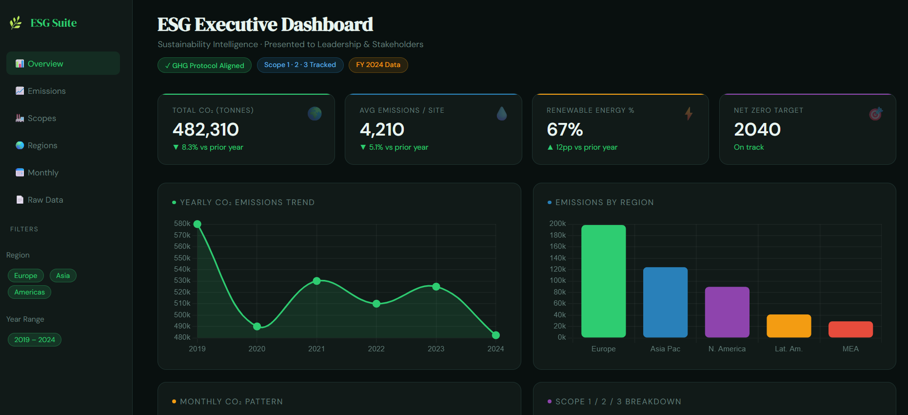
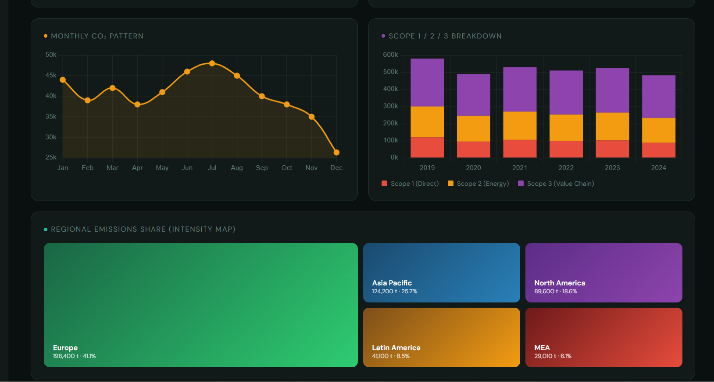

# ESG Executive Reporting Dashboard

> A Streamlit-powered sustainability analytics dashboard built for executive leadership and stakeholder presentations — tracking CO₂ emissions across Scope 1, 2, and 3 with regional and monthly breakdowns.


---

## Table of Contents

- [Overview](#-overview)
- [Live Demo Screenshot](#-live-demo-screenshot)
- [Key Features](#-key-features)
- [Dashboard KPIs](#-dashboard-kpis)
- [Data File & Column Guide](#-data-file--column-guide)
- [Project Structure](#-project-structure)
- [Installation & Setup](#-installation--setup)
- [How to Run](#-how-to-run)
- [Troubleshooting](#-troubleshooting)
- [Tech Stack](#-tech-stack)
- [Roadmap](#-roadmap)
- [Author](#-author)

---

## Overview

This dashboard was built from the perspective of a **Sustainability Manager** needing to communicate complex ESG data clearly to C-suite executives, boards, and external stakeholders.

It consolidates greenhouse gas (GHG) emissions data for Scope 1, 2, and 3 into a clean, interactive executive report aligned with the GHG Protocol standards. Instead of static PowerPoint slides, this delivers a **live, filterable, downloadable** analytics experience.

**Who is this for?**
- Sustainability / ESG Managers
- CEOs, CFOs, and Board Members
- ESG Analysts and Consultants
- Investor Relations & Stakeholder Reporting Teams

---
## Live Demo Screenshot
<p align="center">
  
  
</p>
## Key Features

- **4 Executive KPI Cards** - Total CO₂, Average Emissions, Year-over-Year % Change, Net Zero Target status
- **Yearly Emissions Trend** - Area chart showing multi-year CO₂ trajectory
- **Regional Emissions Breakdown** - Bar chart by geography
- **Monthly CO₂ Pattern** - Seasonality analysis across 12 months
- **Scope 1 / 2 / 3 Stacked Bar** - GHG Protocol scope decomposition by year
- **Regional Intensity Treemap** - Visual share of emissions by region
- **Interactive Sidebar Filters** - Filter by region and year range
- **Download Button** - Export filtered data as CSV

---

## Dashboard KPIs

| KPI | Description | Why It Matters |
|-----|-------------|----------------|
| **Total CO₂ (tonnes)** | Sum of all emissions in filtered view | Primary climate accountability metric |
| **Avg Emissions / Record** | Mean emissions per data point | Tracks efficiency trends |
| **YoY % Change** | Year-over-year delta, auto-calculated | Shows if reduction targets are being met |
| **Net Zero Target Year** | Milestone tracking | Strategic alignment for stakeholders |
| **Scope 1** | Direct emissions (company-owned sources) | Regulatory reporting, direct control |
| **Scope 2** | Indirect from purchased energy | Energy procurement decisions |
| **Scope 3** | Value chain (suppliers, logistics, end use) | Largest share - hardest to reduce |
| **Regional Share** | Treemap of emissions by geography | Identifies highest impact regions |
| **Monthly Seasonality** | Monthly CO₂ pattern | Operations & seasonal planning |

---

## Data File & Column Guide

The dashboard reads from a file called **`emissions_data.csv`** placed in the **same folder** as `esg_dashboard.py`.

### Required Columns

| Column Name | Type | Example | Description |
|---|---|---|---|
| `Year` | Integer | `2024` | Fiscal or calendar year |
| `Month` | String | `Jan` | Three-letter month abbreviation |
| `Region` | String | `Europe` | Geographic region or business unit |
| `Total_CO2` | Float | `38000.0` | Total CO₂ in metric tonnes |
| `Scope1_CO2` | Float | `9500.0` | Scope 1 direct emissions |
| `Scope2_CO2` | Float | `12500.0` | Scope 2 indirect (energy) emissions |
| `Scope3_CO2` | Float | `16000.0` | Scope 3 value chain emissions |

### Sample Data Format

```csv
Year,Month,Region,Total_CO2,Scope1_CO2,Scope2_CO2,Scope3_CO2
2024,Jan,Europe,38000,9500,12500,16000
2024,Jan,Asia,32000,8000,10500,13500
2024,Jan,Americas,27000,6700,8900,11400
```

> ⚠️ **Column names are case-sensitive.** Use exact names shown above.  
> ⚠️ **Month values** must be: `Jan Feb Mar Apr May Jun Jul Aug Sep Oct Nov Dec`  
> ✅ A ready-to-use sample file `emissions_data.csv` is included in this repository.

---

## Project Structure

```
esg-dashboard/
│
├── esg_dashboard.py        ← Main Streamlit app
├── emissions_data.csv      ← Sample dataset (replace with your real data)
├── requirements.txt        ← Python dependencies
└── README.md               ← This file
```

---

## Installation & Setup

### Prerequisites

- Python 3.8 or higher
- pip (comes with Python)

### Step 1 — Clone the Repository

```bash
git clone https://github.com/YOUR_USERNAME/esg-dashboard.git
cd esg-dashboard
```

### Step 2 — Install Dependencies

```bash
pip install -r requirements.txt
```

Or install manually:

```bash
pip install streamlit pandas plotly
```

### Step 3 — Add Your Data

Replace `emissions_data.csv` with your own data file, keeping the same column names shown above. A sample file is included to get you started immediately.

---

## How to Run

```bash
streamlit run esg_dashboard.py
```

Your browser will open automatically at:

```
http://localhost:8501
```

To stop the dashboard, press `Ctrl + C` in the terminal

Note: The dashboard is set up for local execution. A deployed version can be made available for external access if needed.
---

## Troubleshooting

| Problem | Solution |
|---|---|
| `Dataset not found` error | Make sure `emissions_data.csv` is in the **same folder** as `esg_dashboard.py` |
| `Emissions by Region — columns not found` | Check your CSV has columns named exactly `Region` and `Total_CO2` (capital R, capital T) |
| `Module not found` error | Run `pip install streamlit pandas plotly` |
| Charts not showing | Ensure Month values are exactly `Jan`, `Feb`, etc. — not `January` or `01` |
| Scope chart missing | Your CSV must have columns `Scope1_CO2`, `Scope2_CO2`, `Scope3_CO2` |

---

## Tech Stack

| Tool | Purpose |
|---|---|
| [Streamlit](https://streamlit.io) | Web app framework for Python |
| [Plotly Express](https://plotly.com/python/) | Interactive charts (area, bar, line, treemap) |
| [Pandas](https://pandas.pydata.org) | Data loading, cleaning, aggregation |
| Python 3.8+ | Core language |

---

## Roadmap

- [ ] Add intensity metrics (CO₂ per revenue, per employee)
- [ ] Connect to live database / Google Sheets
- [ ] Add PDF export of executive summary
- [ ] Multi-file upload support
- [ ] Target vs Actual tracking visuals
- [ ] Carbon offset & removal tracking

---

## Author

**Bhakti Niwane** — Sustainability & ESG Expert
📧 bhaktin9@gmail.com
🔗 [LinkedIn](https://www.linkedin.com/in/bhakti-niwane-a96199112/)  
🐙 [GitHub](https://github.com/esgpathfinder)

---

## 📄 License

This project is licensed under the MIT License — free to use, modify, and share.

---

> *Built to make sustainability data impossible to ignore.*
